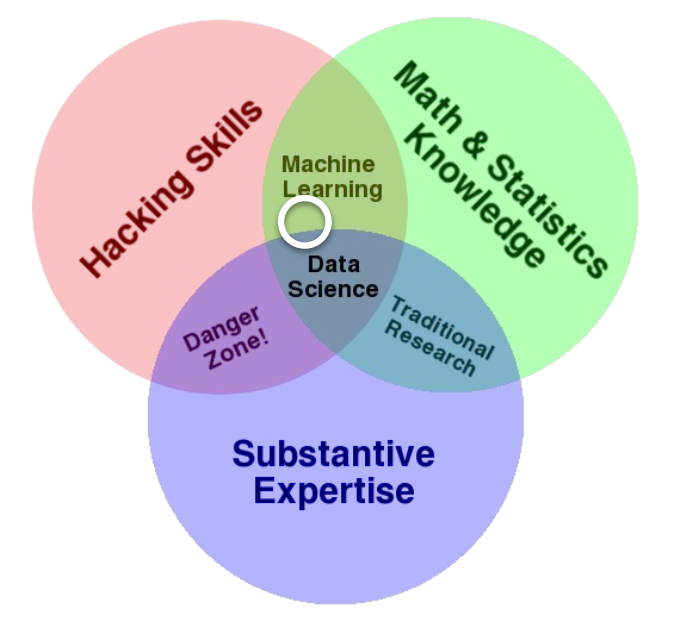

<h1>01 Introduction</h1>

Link to source in picture bellow:

<!-- TOC -->

- [In which year was the first AI conference?](#in-which-year-was-the-first-ai-conference)
- [What are the five important aspects of AI according to J. Copeland in the video?](#what-are-the-five-important-aspects-of-ai-according-to-j-copeland-in-the-video)
- [What is machine learning?](#what-is-machine-learning)
- [Notes](#notes)

<!-- /TOC -->

##  In which year was the first AI conference?
The first AI-conference took place in 1955 at the Darthmouth Conference by J. MCCARTHY. The concepts of AI  were used before this conference e.g by Turing, but during this time these concepts were settled in an undefined field. 

##  What are the five important aspects of AI according to J. Copeland in the video?

j. Copeland defines in the videos following five aspects according the definition of intelligence:
1. Generalization Learning
Learning to perform better in certain circumstanaces and situations
2. Reasoning
Draw conclusions from given scenarios
3. Problem solving
Find X, given certain input data
4. Perception
Analysing scanned Environment(Self-Driving-Car)
5. Language understanding
Understanding human Language(Google-Translation / intelligent Voice assitants = Alexa )

## What is machine learning?
ML(=Machine Learning) refers to algorithms to enable Software to improve over time. In comparison to "plain-coding", ML takes in account the input-output relationship of data. 
Example:
 Coder cant programm a logic to recognize an image of a dog, but he can build an environment and setup to learn in which an AI-Solution could learn from labeled imagedata what a dog is.

Neuronal-Networks (~DeepLearing = DL) are a Subset of theMachine-Learning field. These Algorithms aim to simulate the 
behaviour of the concepts and the operating principle of the human brain.

According to the slides of the lecture ML is the overlapping of the Computer-Hacking-Skills and the Math & Statistics Knowledge:

---
---
---

## Notes

**Example of AI Applications**
- Machine Learning = ML
- Computer Vision = CV
- Self-Driving
- "Gaming-Bot" with different level of implementation
  - Pure "Brute-Force" of further "Gaming Moves" and evalutation
  - Implementation of Weak AI Algorithms
  - Implementation of strong AI Algorithms
- Natural Language Processing = NLP
  - Comparison of documents
  - Knowledge extraction
  - document summary
  - Translations
- Robotics
- Pattern Recognition
- Knowledge Management
- Arts
  - Music
  - Movie
  - Pictures
- Search machines

**Types of AI Aproaches**
- Strong AI
  DL Algorithms
- Weak
  Behave like Humna without simulating the concepts of the brain

**First idea of AI**
J.MCCARTHY / 1955
  *...dass grundsätzlich alle Aspekte des Lernens und anderer Merkmale der Intelligenz so genau beschrieben werden können, dass eine Maschine zur Simulation dieser Vorgänge gebaut werden kann. Es soll versucht werden, herauszufinden, wie Maschinen dazu gebracht werden können, Sprache zu benutzen, Abstraktionen vorzunehmen und Konzepte zu entwickeln, Probleme von der Art, die zurzeit dem Menschen vorbehalten sind, zu lösen, und sich selbst weiter zu verbessern.*

**Definition AI**

* Machine / Program /Sofrware Code
* Learn Task
  * Require inteligence
* usually done by Humans

**7 Concepts of AI**
1) Simulating human brain
2) Geralization language
3) Architecuture of neuronal networks
4) Complexity Concept
5) Improvement over time
6) Abstraction
7) Randomness and creativity

Inteligence comes in many forms

**Expert System**

 AI = Expert system
 - Employs human inteligence in a Computer
 - Practical Application of an Database
 - 