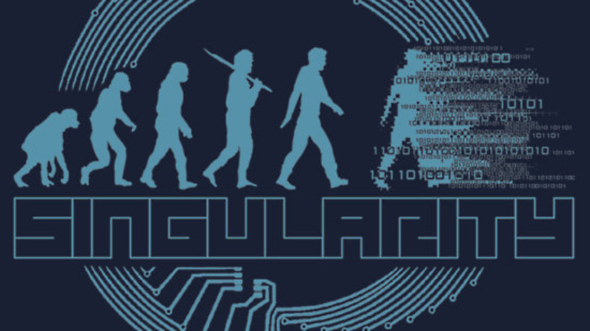
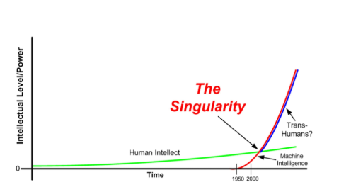

<h1>AI-Singularity</h1>

Link to source in picture bellow:

# What is meant with Singularity?
In mathematics and pyhsics the term **singularity** reffers to an point(e.g. in acartesian coordinate system) in which the value of an certain variable start to rapidly increase to infernity.
Transfering the conspet to the domain of AI / ML singularity is interpreted with the point, in which the [intelligence](./01_IntorducitonToAI.md) of technical devices(Software/Machine/...) surpasses the human level of cognitive ability. (e.g. humantiy builds an intelligent system which is able to build another, even more intelligent technical system...this will lead to the super-intellignece). If humanity is able to build such a basic intelligent system which is able to improve itself without human inverventions humanity will lose the control over the according ressources
 At this stage of time we havent passed the border to singularity, but we already started to build the first intelligent systems. 

In a common scene singularity is an term of the Sci-Fi-domain. In this context singularity is an scenario what might happen to humans in connection with an powerful intelligent system. 

The term [intelligence](./01_IntorducitonToAI.md) in the AI-context reffers to the ability to connect different subdomains of AI (NLP, CV, Language understanding...). another interpretation of [Intelligence](./01_IntorducitonToAI.md) is asSystem which is able to deal with the previous cluster of all these skills in addition with a sophisticated dealing in a scientific and technological manner.

# Why are values important in the case of Singularity?

According to [David Chalmers](http://consc.net/) it's important to deal with the topic of singularity from a human philosophical point of view before we reach the stage of singularity from the technical development. 
If humanity is able to build systems which are more intelligent, than humans are, these system should perform an ethical way and with the social state of the art we want them to perform. 
The domain of [AI & ML & DL](./02_AI_Singularity.md) is powerful on both sides. It could be desiged for a good purpose like defeating deseases, poverty human mortality and many other topics the humanity is dealing with. On the other hand the implementaiton could be in a bad ciscumstance e.g the diregarding of specific human minorities, fighting for private and not social purposes or self sufficient concepts with an huhge violent threat

With this Information in mind it's important for AI-driven concepts to act in an ethical way. Consequently experts in philosophical domains are necessary to develop base-line system of the well-known-questions of humanity concerning "the good and the bad" implemented in technical systems.

# What is the problem of other minds?

The over-all problem is the technical an the ethical ability of implementing AI with a singular manifestation. On the one hand we don't wana create such a system with the potential threat to humanity. On the other hand we also want prevent other nations & concern to build this technology of singularity, while there no own know-how to deal with this topic. 

According to the slides the restriction and regimentation of the AI-Technologies requires  global enforcements and detailed common standards like the reglemenation of th stem cells & nuclear reasearches.
