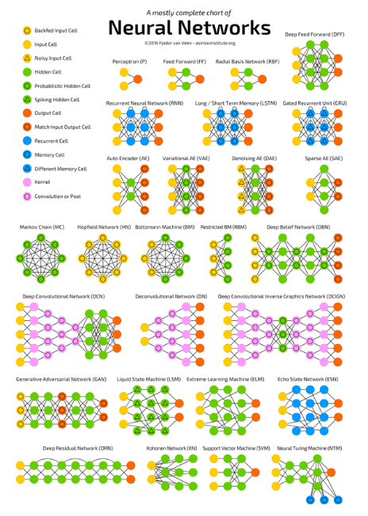

<h1>Neural Networks</h1>

Link to source in picture bellow:

<!-- TOC -->

- [Describe all types of neural networks that are shown in the video.](#describe-all-types-of-neural-networks-that-are-shown-in-the-video)
- [Research in the internet, which neural network performs best with the MNIST dataset (digits from 0 to 9)](#research-in-the-internet-which-neural-network-performs-best-with-the-mnist-dataset-digits-from-0-to-9)
- [Deep dive: Find some numbers about how many neurons the top neural networks for image classification have.](#deep-dive-find-some-numbers-about-how-many-neurons-the-top-neural-networks-for-image-classification-have)

<!-- /TOC -->

# Describe all types of neural networks that are shown in the video.

NN are technical software implementations which simulate the operating principle of the human brain. In the following part we will discuss these steps from the basic function of a single neuron (Single-layer perceptron) to differen complex "neuron-interconnected" networks. The interesting part is that the operating principle of the human brain(based on carbon = component of the human body) and the technical implementation in technical computer-chips(based on silicon).

1. Neuronal Networks
     1. Single-Layer-Perceptron
     A Single-Layer Perceptron is an Neural-Network Architecture which consist of on single Perceptron (=> Perceptron-NN is NO deep-Learning architecture because the hidden Layer is missing). A perceptron is a technical consturct build with the model of a human nerve-Cell(=neuron.) The main components of a perceptron are:
        - Input
        - Weights
        - Threshold
        - Output
        - Activation-Function
        - Bias
  

   
   or
   

   ---

   1. Multi-Layer Perceptron

     the MLP is a further development of the Single-Layer Perceptron. In the MLP we start to arrange more neurons and interconnect them in a serial or parallel order. With this different arrangements we achieve different hierarchical architectures/structures. With rising number of neurons and layes we add much more complexity to the model.

     Basic-Idea of MLPs:
     

     Examples of Neuronal-Networks:   
     

     The following distinctions depends on the direction the "signal" flows through the network. "if the connections go only in one direction from input to output it is a feed forwad network". Resonance is prevented by avoiding cirucular connections"

     "Networks with specific circular connections are called [recurrent neural networks](./05_RNNs.md)"

       
   ---

   3. Convolutional Neuronal-Network
   CNNs are a famous architecture concepts for Computer-Vision. In addition to the MLPs we add further technical conepts like:
   - Filter
   - Padding&Strides
   - Pooling-Layer
   - Fully-Connected Layer
   These feature support the transformation of the digital Picture in an calculateable vector.

   These concepts are explained in a more detailed way in the [CNN-Notes](./05_CNNs.md)

   ---

   4. Spiking Neuronal Network
   SNN are the further development and the dependence to the human brain. Consequently they add a variable "time" and different acitivation levels of a neurons. The activation level varies during time, depending on how many incoming Signals arrive. With a certain threshold the neuron fires it own signal throught the network. 

   

#  Research in the internet, which neural network performs best with the MNIST dataset (digits from 0 to 9)

According the [PaperswithCode](https://paperswithcode.com/sota/image-classification-on-mnist) the best models for the MNIST-Dataset are:

   
- [Branching/Merging CNN + Homogeneous Filter Capsules](https://arxiv.org/pdf/2001.09136v3.pdf)
  and
- EnsNet 

both with an Errorrate of 0.16 and Accuracy of 99.84. Furthermore are both using an ensembler Learning.

# Deep dive: Find some numbers about how many neurons the top neural networks for image classification have.

According tothe [Branching/Merging CNN + Homogeneous Filter Capsules](https://arxiv.org/pdf/2001.09136v3.pdf) they have following number of trainable parameters:

Just as a quick & dirty comparison: A human brain consits of up to 10^11 neurons. The current DL-Algorithms consist of 0,0015141877% = 0,015 ‰(=1514187/10^11) in the number of human neurons. The number of human neurons comes from the slides of the lecture.

