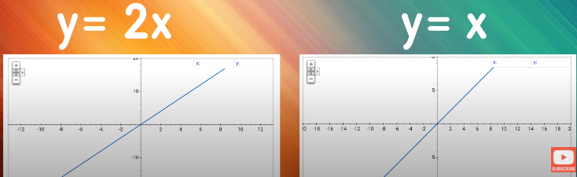
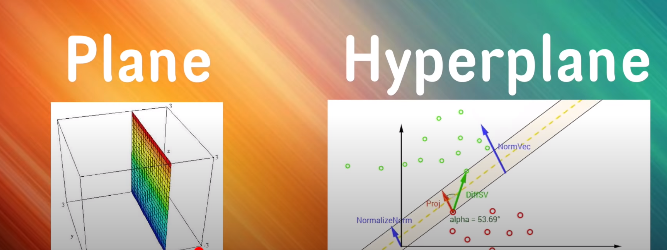
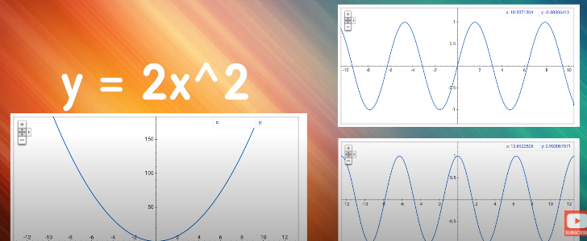
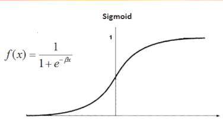
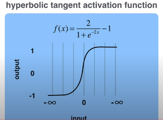
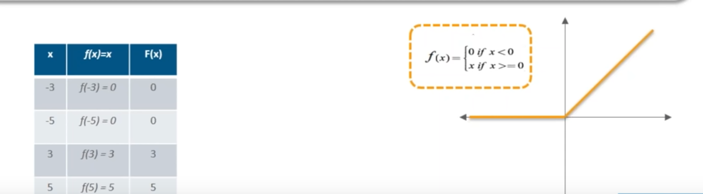

<h1>Activation Functions</h1>

Link to source in picture bellow:

<!-- TOC -->

- [Activation Function - Definition](#activation-function---definition)
- [Why do we need non-linear activation functions?](#why-do-we-need-non-linear-activation-functions)
- [Why do we need to differentiate the activation function?](#why-do-we-need-to-differentiate-the-activation-function)
- [What is a good choice for an activation function?](#what-is-a-good-choice-for-an-activation-function)

<!-- /TOC -->

# Activation Function - Definition

Activation Functions(AF) define the way how neurons communicate in between. Usually there is a Activation Function or threshold. Depending on the "current Activation-Level" and the correspondending threshold of the neuron the neuron passes/fires a signal through the following parts of the neural network or it doesnt. The Activation Functions affects this operation.

#  Why do we need non-linear activation functions?
With AF we add non-linear properties to the neuronal network. With this "new" feature in the NN is able to detect not only linear and also non-linear = any kind of  functions. Almost every Skill can be expressed in a function(e.g. naming a song, translating between languages, classifying digital images...)
Without AF, we would be only be able to detect linear patterns in data which would be easier, but wouldn't detect all "possibile" baselines e.g.all possible forms of curves (x^2, x^3,... x^n sin, tan, cos...). 

In mathematical terms we add further polynoms to our function. These polynominals are the basic precondition for the further derivations. 

E.g. Functions. with **1 polynominal** degree = linear / plain / hyperplain

E.g. Functions with **>1 poynominal degrees** = curves

#  Why do we need to differentiate the activation function?
Differentable = Ability ot calculate the derivative
The basic operating- principle of a NN - DL is:

1. Feed vectorized data to the input layer
2. Direct the data through the NN-Architecture
   1. series of Matrix-Calculations layer by layer
   2. weight*input+bias 
   3. Pass or dont pass output to the next layer
3. In the output layer calculate the predicted output
4. Calculate the errorrate
5. Compute partial derivative
6. Update the weights of the base-line-NN within the Back-Propagation-Optimiazation (BPO)

Within the steps of the  Back-Propagation-Optimiazation(BPO) we have to optimize (find the lowest) Error-Value. This optimization is done by the derivative of the activation-function and the updating of the weight-value. 

# What is a good choice for an activation function?

- **Sigmoid & TanH** are already obsolete, because of their vanishing-gradient-problem and the non-zero-centered circumstance(just Sigmoid)
- 

- **ReLU** is used in hidden layer, Relu avoids vanishing-gradients, learns faster than Sigmoid
  - Variations of **ReLU** are used **MaxOut**, **Leaky-Relu**(keep update of neurons alive)

**Example of Relu:**

- Output-Fct depend on the DL-problem
  - Regression: Linear Function
  - Classification: SoftMax(Returns probabilities per class)

