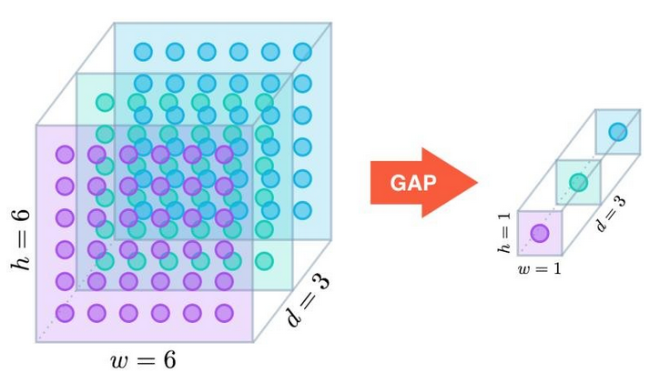

<h1>CNN</h1>

Link to source in picture bellow:

# What is a filter?
## Synonyms
- Filter
- Feature
- Kernel
  

## Hyperparameter in convolutional layer
- Number of filters
- Size of filters
- Step-Size = Stride

## Process during Convolutional-Layer
1. Detect a number(n) of filters
2. Detect size of filters (horizontal & Vertical); the size is smaller than the size of the input image
3. Detect stepsize for the convolutional layer
4. for each filter
   1. put it in the upper left corner of the input image and align euqality of the current observed area(=filter is smaller than input image => observed Area the part which the filter covers on the input image)
   2. According to the equality of the observed area note the result in a further Matrix (MF_N), specific for this filter
   3. relocate the current filter within in the input-image according the stepsize from the hyperparameters
   4. Check again the equality of the current filter with the current part of the input image
   5. write the results to the MF_N
   6. Repeat proceses 4&5 until the whole input image is covered with the current filter
   7. Repeat the Process 1-6 until all chosen filters(given from the hyperparameters) were used.

the Output of the convolutional layer are n matrices, which show the specific equality betwenn the specific filter and the input image

E.g if we decide to use 3 Filters within a CNN we have following setup:

**Input**
- one image to be classified
- 3 basic filters
**output**
- 3 Matrics corresponding to the equality of the striding Filter to the input data
- one input image is trafnsfered to a stack of 3 output images

## Answer to question
A filter is a matrix which initialy is used to compare a certain picture section with the filter. Within the Convolutional Layer are many filters in use.

# What is the purpose of a pooling layer?
## Synonyms
- pooling
- max-pooling

## Hyperparameter
- Window size
- Step-Size

## Aim of pooling
The filter matrices(output of convolutional layer) get shrinked. These smaller images could be better used in the further CNN-process.

## Process during Pooling-Layer
The process of the pooling layer is similar to the process of the convolutional layer. There is again a "window/matrix"
 which covers the MF_N with a certain Stepsize. The output of the pooling layer are n Pooling Matrices (MP_N)  which are smaller than the input (in this case the specific MF_Ns)

 1. Take one MF_N
 2. Set pooling window(with the hyperparameter windows size) in the upper left corner
 3. Take the highest value from the current observed area transfer this value to the MP_N
 4. slide the windows according the stepsize
 5. Repeat process 2-4 until the whole current MF_N is covered
 6. Repeat process 1-5 until all input MF_Ns are covered

**Output**
the output of the pooling layer are N smaller matrices(= MP_N) of the input matrices(=MF_N)

These output matrices are usually delivered to a **Relu** Function. After this RELU-layer we have N-Matrices with the same size. All of these matrices have the min value of 0 and no negative values.

# What is the purpose of the fully connected layer at the head of a CNN?

The convolutional & pooling layer transfered the input images to N "new matirces" with a smaller size. These processes of convolutional and pooling layer could be arranged many times in a loop.

The fully connecected layer takes the output of the "last-upstreamed" pooling layer and flattens these n-matrices to a onedimensional vector.

This resulting vector is used as the input layer for a [Neuronal-Network](./03_Neural_Networks.md)-

# Deepdive: some networks use a layer called global average pooling. Find out what this layer does and which improvement results. 
 According to the [Link](https://alexisbcook.github.io/2017/global-average-pooling-layers-for-object-localization/) Global Average Pooling has the aim to minimize the overfitting by reducint the total number of paramters in a model.

 "Similar to max pooling layers, GAP layers are used to reduce the spatial dimensions of a three-dimensional tensor. However, GAP layers perform a more extreme type of dimensionality reduction, where a tensor with dimensions h×w×d is reduced in size to have dimensions 1×1×d. GAP layers reduce each h×w feature map to a single number by simply taking the average of all hw values."
 
 

